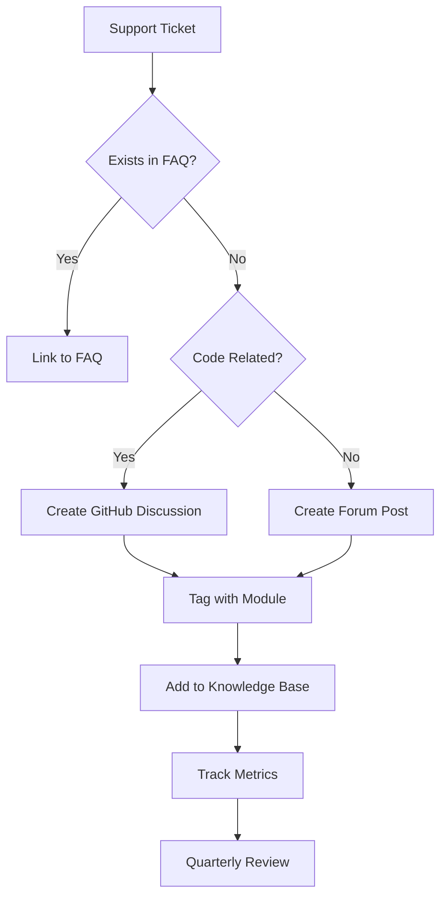

# Community Surface - Forum + Discussions Setup

## Overview
Create a two-tier community system: Discourse for general discussions and GitHub Discussions for code-related Q&A. All answers must be solved/marked as answered to maintain quality.

---

## Discourse Forum Configuration

### 1. Installation & Setup
```yaml
# SECURE: docker-compose.yml for Discourse
version: '3.8'

services:
  discourse:
    image: discourse/discourse:stable
    restart: always
    hostname: discourse.c2concierge.com
    ports:
      - "80:80"
      - "443:443"
    env:
      DISCOURSE_DEVELOPER_EMAILS: '${DISCOURSE_DEVELOPER_EMAILS}'
      DISCOURSE_HOSTNAME: '${DISCOURSE_HOSTNAME}'
      DISCOURSE_SMTP_ADDRESS: '${DISCOURSE_SMTP_ADDRESS}'
      DISCOURSE_SMTP_PORT: '${DISCOURSE_SMTP_PORT}'
      DISCOURSE_SMTP_USERNAME: '${DISCOURSE_SMTP_USERNAME}'
      DISCOURSE_SMTP_PASSWORD: '${DISCOURSE_SMTP_PASSWORD}'
      DISCOURSE_SMTP_ENABLE_START_TLS: 'true'
      DISCOURSE_DB_HOST: 'postgres'
      DISCOURSE_DB_USERNAME: 'discourse'
      DISCOURSE_DB_PASSWORD: '${DISCOURSE_DB_PASSWORD}'
      DISCOURSE_REDIS_HOST: 'redis'
      # SECURITY: Additional security settings
      DISCOURSE_SERVE_STATIC_ASSETS: 'true'
      DISCOURSE_CDN_URL: '${DISCOURSE_CDN_URL}'
      DISCOURSE_FORCE_HTTPS: 'true'
    volumes:
      - /var/discourse/shared/webmail:/shared
      - /var/discourse/shared/webmail/log/var/log:/shared/log/var/log
    # SECURITY: Network isolation
    networks:
      - discourse-network
    # SECURITY: Resource limits
    deploy:
      resources:
        limits:
          memory: 2G
        reservations:
          memory: 1G

  postgres:
    image: postgres:14-alpine
    restart: always
    environment:
      POSTGRES_USER: discourse
      POSTGRES_PASSWORD: '${DISCOURSE_DB_PASSWORD}'
      POSTGRES_DB: discourse
      # SECURITY: PostgreSQL security settings
      POSTGRES_INITDB_ARGS: '--auth-host=scram-sha-256'
    volumes:
      - postgres_data:/var/lib/postgresql/data
    networks:
      - discourse-network
    # SECURITY: Resource limits
    deploy:
      resources:
        limits:
          memory: 1G
        reservations:
          memory: 512M

  redis:
    image: redis:7-alpine
    restart: always
    command: redis-server --appendonly yes --requirepass '${REDIS_PASSWORD}'
    volumes:
      - redis_data:/data
    networks:
      - discourse-network
    # SECURITY: Resource limits
    deploy:
      resources:
        limits:
          memory: 256M
        reservations:
          memory: 128M

# SECURITY: Network configuration
networks:
  discourse-network:
    driver: bridge
    internal: false
    ipam:
      config:
        - subnet: 172.20.0.0/16

# SECURITY: Volume configuration
volumes:
  postgres_data:
    driver: local
  redis_data:
    driver: local
```

### 2. Categories & Tags Structure
```ruby
# SECURE: Discourse categories configuration
categories:
  - name: "Getting Started"
    color: "0088CC"
    text_color: "FFFFFF"
    description: "New to C2PA? Start here with guides and basic questions"
    slug: "getting-started"
    permissions:
      everyone: "see"
      everyone: "create_topic"
    
  - name: "Technical Support"
    color: "E45735"
    text_color: "FFFFFF"
    description: "Get help with implementation, bugs, and technical issues"
    slug: "technical-support"
    permissions:
      everyone: "see"
      everyone: "create_topic"
    
  - name: "Stack-Specific"
    color: "F1A340"
    text_color: "FFFFFF"
    description: "Discussions for specific platforms (WordPress, Shopify, etc.)"
    slug: "stack-specific"
    subcategories:
      - name: "WordPress"
        slug: "wordpress"
      - name: "Shopify"
        slug: "shopify"
      - name: "Cloudflare Workers"
        slug: "cloudflare"
      - name: "Next.js"
        slug: "nextjs"
      - name: "Fastify"
        slug: "fastify"
    
  - name: "Best Practices"
    color: "4E79A7"
    text_color: "FFFFFF"
    description: "Share and discuss proven patterns and implementations"
    slug: "best-practices"
    permissions:
      everyone: "see"
      everyone: "create_topic"
    
  - name: "Show & Tell"
    color: "59A14F"
    text_color: "FFFFFF"
    description: "Show off your C2PA implementations and get feedback"
    slug: "show-tell"
    permissions:
      everyone: "see"
      everyone: "create_topic"

# SECURITY: Tag system for better organization
tags:
  - name: "bug"
    color: "E45735"
    description: "Report a bug or issue"
    
  - name: "feature-request"
    color: "F1A340"
    description: "Request a new feature"
    
  - name: "question"
    color: "4E79A7"
    description: "Ask a question"
    
  - name: "tutorial"
    color: "59A14F"
    description: "Tutorial or guide"
    
  - name: "security"
    color: "AF7AA1"
    description: "Security-related discussion"
```

### 3. Solved Answers Plugin Configuration
```ruby
# SECURE: Discourse plugin configuration for solved answers
plugins:
  - name: "discourse-solved"
    enabled: true
    settings:
      # Enable solved answers on all categories
      all_categories: true
      # Allow topic creators and staff to mark as solved
      allow_solved_on_all_topics: true
      # Display solution count
      display_solutions_count: true
      # Security: Rate limiting for solution marking
      solution_mark_rate_limit: "1 per minute"

# SECURITY: Anti-spam and moderation settings
site_settings:
  # Rate limiting
  rate_limit_create_topic: "5 per minute"
  rate_limit_create_post: "30 per minute"
  rate_limit_new_user: "3 per minute"
  
  # Content filtering
  max_topic_title_length: 100
  max_post_length: 28000
  min_post_length: 5
  
  # Security settings
  enable_s3_uploads: true
  s3_access_key_id: "${S3_ACCESS_KEY}"
  s3_secret_access_key: "${S3_SECRET_KEY}"
  s3_bucket: "${S3_BUCKET_NAME}"
  s3_region: "${S3_REGION}"
  
  # Authentication
  enable_local_logins: false
  enable_sso: true
  sso_url: "${SSO_PROVIDER_URL}"
  
  # HTTPS enforcement
  force_https: true
  use_ssl: true
```

### 4. Automated Support Deflection
```javascript
// SECURE: Discourse automation for support deflection
class SupportDeflectionBot {
  constructor() {
    this.apiKey = process.env.DISCOURSE_API_KEY;
    this.baseUrl = process.env.DISCOURSE_BASE_URL;
    this.deflectionThreshold = 0.8;
  }
  
  // SECURITY: Validate and sanitize search queries
  sanitizeQuery(query) {
    return query
      .trim()
      .substring(0, 200)
      .replace(/[<>]/g, '')
      .replace(/javascript:/gi, '');
  }
  
  async searchSimilarTopics(query) {
    const sanitizedQuery = this.sanitizeQuery(query);
    
    try {
      const response = await fetch(`${this.baseUrl}/search/query`, {
        method: 'POST',
        headers: {
          'Content-Type': 'application/json',
          'Api-Key': this.apiKey,
          'Api-Username': 'system'
        },
        body: JSON.stringify({
          term: sanitizedQuery,
          include_blurbs: true,
          limit: 5
        })
      });
      
      if (!response.ok) {
        throw new Error(`Search failed: ${response.status}`);
      }
      
      const data = await response.json();
      return this.filterRelevantResults(data.topics || []);
    } catch (error) {
      console.error('Support deflection search error:', error);
      return [];
    }
  }
  
  // SECURITY: Filter results based on relevance and safety
  filterRelevantResults(topics) {
    return topics
      .filter(topic => topic.score > this.deflectionThreshold)
      .filter(topic => !topic.closed && !topic.archived)
      .slice(0, 3);
  }
  
  async suggestRelatedTopics(query) {
    const similarTopics = await this.searchSimilarTopics(query);
    
    if (similarTopics.length > 0) {
      return {
        hasSuggestions: true,
        suggestions: similarTopics.map(topic => ({
          id: topic.id,
          title: this.escapeHtml(topic.title),
          url: `${this.baseUrl}/t/${topic.slug}/${topic.id}`,
          score: topic.score,
          posts_count: topic.posts_count,
          last_posted_at: topic.last_posted_at
        }))
      };
    }
    
    return { hasSuggestions: false };
  }
  
  // SECURITY: HTML escaping
  escapeHtml(text) {
    return text
      .replace(/&/g, '&amp;')
      .replace(/</g, '&lt;')
      .replace(/>/g, '&gt;')
      .replace(/"/g, '&quot;')
      .replace(/'/g, '&#039;');
  }
}

// Export for use in Discourse plugin
module.exports = SupportDeflectionBot;
```
    position: 2
    
  - id: 3
    name: "Shopify"
    color: "95BF47"
    text_color: "FFFFFF"
    description: "Shopify themes, Liquid snippets, and app integration"
    slug: "shopify"
    parent_category_id: 1
    topic_count: 0
    post_count: 0
    position: 3
    
  - id: 4
    name: "Cloudflare Workers"
    color: "F38020"
    text_color: "FFFFFF"
    description: "Edge computing, Workers KV, and manifest proxy setup"
    slug: "cloudflare-workers"
    parent_category_id: 1
    topic_count: 0
    post_count: 0
    position: 4
    
  - id: 5
    name: "Next.js"
    color: "000000"
    text_color: "FFFFFF"
    description: "React frameworks, middleware, and static generation"
    slug: "nextjs"
    parent_category_id: 1
    topic_count: 0
    post_count: 0
    position: 5
    
  - id: 6
    name: "Fastify"
    color: "000000"
    text_color: "FFFFFF"
    description: "Node.js servers, plugins, and API integration"
    slug: "fastify"
    parent_category_id: 1
    topic_count: 0
    post_count: 0
    position: 6
    
  - id: 7
    name: "Compliance & Legal"
    color: "E74C3C"
    text_color: "FFFFFF"
    description: "EU AI Act, DSA, FTC compliance and disclosure requirements"
    slug: "compliance"
    topic_count: 0
    post_count: 0
    position: 7
    
  - id: 8
    name: "API & SDK"
    color: "9B59B6"
    text_color: "FFFFFF"
    description: "REST API, SDK usage, and integration examples"
    slug: "api-sdk"
    topic_count: 0
    post_count: 0
    position: 8
    
  - id: 9
    name: "Show & Tell"
    color: "27AE60"
    text_color: "FFFFFF"
    description: "Share your implementations and success stories"
    slug: "show-tell"
    topic_count: 0
    post_count: 0
    position: 9

# Tags system
tags:
  - name: "module-1"
    description: "Related to Module 1: Why Embeds Break & Remote Survives"
    
  - name: "module-2"
    description: "Related to Module 2: Your Stack in 15 Minutes"
    
  - name: "module-3"
    description: "Related to Module 3: Verifiers & Proofs"
    
  - name: "module-4"
    description: "Related to Module 4: Sandboxes & Optimizers"
    
  - name: "module-5"
    description: "Related to Module 5: Compliance in One Sprint"
    
  - name: "cai-verify"
    description: "Adobe Content Authenticity Initiative verification"
    
  - name: "remote-manifest"
    description: "Remote manifest implementation and troubleshooting"
    
  - name: "compliance"
    description: "Regulatory compliance and disclosures"
    
  - name: "solved"
    description: "Question has been answered and solution verified"
```

### 3. Solved Answer Plugin Configuration
```javascript
// discourse-solved-plugin.js - Custom plugin for solved answers
export default {
  name: 'discourse-solved-plugin',
  
  initialize() {
    // Add solved button to posts
    api.addPostMenuButton('solved', {
      icon: 'check-square',
      label: 'Mark as Solved',
      action: 'markAsSolved',
      classNames: ['solved-button'],
      visible: () => {
        // Only show to OP and staff
        return api.getCurrentUser().id === api.getPost().user_id || 
               api.getCurrentUser().staff;
      }
    });
    
    // Add solved indicator to topics
    api.decorateWidget('topic-status', (dec) => {
      const topic = dec.model;
      if (topic.solved_post_id) {
        return dec.h('span.solved-indicator', { title: 'Solved' }, '✓');
      }
    });
    
    // Filter topic lists to prioritize solved answers
    api.addTopicListFilter('solved', {
      label: 'Solved Questions',
      filter: (topics) => topics.filter(t => t.solved_post_id)
    });
  }
};
```

### 4. Automated Support Deflection
```javascript
// support-deflection-bot.js
class SupportDeflectionBot {
  constructor() {
    this.knowledgeBase = new Map();
    this.initializeKnowledgeBase();
  }
  
  initializeKnowledgeBase() {
    // Pre-load 20 solved FAQs with copy/paste snippets
    this.knowledgeBase.set('wordpress manifest not working', {
      solution: `
        Check these common issues:
        1. Ensure your functions.php has the correct hook priority
        2. Verify your CDN URL is accessible
        3. Test with curl: curl -I "https://yoursite.com/image.jpg"
        
        Working snippet:
        \`\`\`php
        add_action('send_headers', function() {
            if (preg_match('/\\.(jpg|jpeg|png|webp)$/i', $_SERVER['REQUEST_URI'])) {
                $asset_name = basename($_SERVER['REQUEST_URI']);
                header('Link: <https://cdn.yourdomain.com/manifests/' . $asset_name . '.json>; rel="c2pa-manifest"');
            }
        });
        \`\`\`
      `,
      forumLink: 'https://community.c2concierge.com/t/wordpress-manifest-troubleshooting/123',
      module: 'module-2'
    });
    
    this.knowledgeBase.set('cai verify not showing manifest', {
      solution: `
        CAI Verify needs the correct URL format:
        1. Use the full asset URL, not the manifest URL
        2. Ensure the asset returns the Link header
        3. Check CORS headers are set correctly
        
        Test URL: https://contentauthenticity.org/verify?url=YOUR_ASSET_URL
      `,
      forumLink: 'https://community.c2concierge.com/t/cai-verify-troubleshooting/456',
      module: 'module-3'
    });
    
    // Add 18 more FAQs...
  }
  
  deflectSupport(ticket) {
    const question = ticket.subject.toLowerCase();
    const answer = this.findAnswer(question);
    
    if (answer) {
      return {
        deflected: true,
        response: `I found a solved answer for your question:\n\n${answer.solution}\n\nFor more details, see: ${answer.forumLink}`,
        module: answer.module
      };
    }
    
    return { deflected: false };
  }
  
  findAnswer(question) {
    for (const [key, value] of this.knowledgeBase) {
      if (question.includes(key)) {
        return value;
      }
    }
    return null;
  }
}
```

---

## GitHub Discussions Setup

### 1. Repository Configuration
```yaml
# .github/discussions.yml
categories:
  - name: "General"
    description: "General questions about C2PA and provenance"
    color: "fbca04"
    
  - name: "SDK Usage"
    description: "How to use our SDKs and APIs"
    color: "0075ca"
    
  - name: "Bug Reports"
    description: "Report bugs and issues"
    color: "d93f0b"
    
  - name: "Feature Requests"
    description: "Request new features and enhancements"
    color: "a2eeef"
    
  - name: "RFCs"
    description: "Request for Comments on technical proposals"
    color: "7057ff"
    
  - name: "Show and Tell"
    description: "Share your projects and implementations"
    color: "128a0c"
    
labels:
  - name: "question"
    description: "Questions and help requests"
    color: "d876e3"
    
  - name: "documentation"
    description: "Documentation related discussions"
    color: "0075ca"
    
  - name: "good first issue"
    description: "Good for newcomers"
    color: "7057ff"
    
  - name: "help wanted"
    description: "Community help requested"
    color: "008672"
```

### 2. Discussion Templates
```markdown
<!-- .github/DISCUSSION_TEMPLATE/question.md -->
### Question Checklist

- [ ] I've searched for existing discussions
- [ ] I've read the documentation
- [ ] I've checked the FAQ

### Question
<!-- Clearly describe your question -->

### Context
<!-- Provide context about your setup -->
- Platform: (WordPress/Shopify/Cloudflare/Next.js/Fastify)
- Version: 
- Error message (if any):

### What You've Tried
<!-- Describe what you've already attempted -->

### Code Snippet
<!-- Share relevant code -->

### Expected vs Actual
<!-- What did you expect vs what actually happened -->

### CAI Verify Link
<!-- If applicable, share your CAI Verify link -->
```

```markdown
<!-- .github/DISCUSSION_TEMPLATE/rfc.md -->
### RFC: [Title]

### Summary
<!-- One-sentence summary -->

### Motivation
<!-- Why is this change needed? -->

### Detailed Design
<!-- Technical details -->

### Rationale and Alternatives
<!-- Why this approach over alternatives -->

### Unresolved Questions
<!-- What still needs to be decided -->

### Implementation Plan
<!-- Steps to implement -->
```

---

## Community Playbook

### 1. Support Response Template
```markdown
## Support Response Template

### Initial Response
```
Hi [Name],

I understand you're having trouble with [issue]. I've found a solved answer in our community that should help:

[SOLUTION FROM FORUM]

This solution was verified by [number] community members and relates to [module name].

If you're still having issues after trying this, please let me know and I'll be happy to help further.

Best regards,
[Support Agent]
```

### Escalation Template
```
Hi [Name],

I've reviewed our community resources and this appears to be a unique issue that requires deeper investigation.

I'm escalating this to our engineering team and will get back to you within [timeframe].

In the meantime, could you provide:
1. Your implementation details
2. Error logs
3. CAI Verify link (if applicable)

I'll also create a new forum thread for this issue so the community can benefit from the solution.

Best regards,
[Support Agent]
```

### 2. Content Creation Workflow


### 3. Quarterly Content Review Process
```javascript
// content-review-script.js
class ContentReviewProcessor {
  constructor() {
    this.metrics = {
      forumViews: new Map(),
      githubViews: new Map(),
      supportDeflections: new Map(),
      conversions: new Map()
    };
  }
  
  async generateQuarterlyReport() {
    const report = {
      period: this.getQuarterPeriod(),
      topPerforming: [],
      underperforming: [],
      recommendations: []
    };
    
    // Analyze forum content
    const forumMetrics = await this.analyzeForumContent();
    report.topPerforming.push(...forumMetrics.top);
    report.underperforming.push(...forumMetrics.bottom);
    
    // Analyze GitHub discussions
    const githubMetrics = await this.analyzeGitHubDiscussions();
    report.topPerforming.push(...githubMetrics.top);
    report.underperforming.push(...githubMetrics.bottom);
    
    // Generate recommendations
    report.recommendations = this.generateRecommendations(report);
    
    return report;
  }
  
  generateRecommendations(report) {
    const recommendations = [];
    
    // Content to expand
    report.topPerforming.forEach(item => {
      if (item.conversionRate > 0.1) {
        recommendations.push({
          action: 'expand',
          content: item.id,
          reason: `High conversion rate (${item.conversionRate}%)`,
          suggestion: 'Create advanced tutorial or webinar'
        });
      }
    });
    
    // Content to prune
    report.underperforming.forEach(item => {
      if (item.views < 50 && item.age > 90) {
        recommendations.push({
          action: 'prune',
          content: item.id,
          reason: `Low engagement (${item.views} views in ${item.age} days)`,
          suggestion: 'Archive or merge with similar content'
        });
      }
    });
    
    return recommendations;
  }
}
```

---

## Automation Scripts

### 1. Forum-to-GitHub Sync
```javascript
// forum-github-sync.js
class ForumGitHubSync {
  constructor() {
    this.discourseClient = new DiscourseClient();
    this.githubClient = new GitHubClient();
  }
  
  async syncSolvedQuestions() {
    const solvedQuestions = await this.discourseClient.getSolvedQuestions();
    
    for (const question of solvedQuestions) {
      if (this.isCodeRelated(question)) {
        await this.createGitHubDiscussion(question);
      }
    }
  }
  
  isCodeRelated(question) {
    const codeKeywords = ['sdk', 'api', 'javascript', 'php', 'python', 'code', 'implementation'];
    const title = question.title.toLowerCase();
    const content = question.content.toLowerCase();
    
    return codeKeywords.some(keyword => 
      title.includes(keyword) || content.includes(keyword)
    );
  }
  
  async createGitHubDiscussion(forumQuestion) {
    const discussionBody = `
      **Originally posted on the CredLink Forum**: ${forumQuestion.url}
      
      ${forumQuestion.content}
      
      ---
      
      **Solution**: ${forumQuestion.solution}
      
      **Tags**: ${forumQuestion.tags.join(', ')}
    `;
    
    await this.githubClient.createDiscussion({
      title: forumQuestion.title,
      body: discussionBody,
      repository: 'c2-concierge/sdk',
      category: 'SDK Usage'
    });
  }
}
```

### 2. Automated FAQ Updates
```javascript
// auto-faq-updater.js
class AutoFAQUpdater {
  constructor() {
    this.threshold = 5; // Minimum upvotes to become FAQ
    this.ageThreshold = 30; // Days
  }
  
  async updateFAQs() {
    const recentPosts = await this.getRecentPosts(this.ageThreshold);
    const potentialFAQs = recentPosts.filter(post => 
      post.upvotes >= this.threshold && 
      post.solution_accepted
    );
    
    for (const faq of potentialFAQs) {
      await this.addToKnowledgeBase(faq);
      await this.notifyCommunity(faq);
    }
  }
  
  async addToKnowledgeBase(faq) {
    const entry = {
      question: faq.title,
      answer: faq.solution,
      tags: faq.tags,
      forumLink: faq.url,
      module: faq.module,
      addedAt: new Date().toISOString()
    };
    
    await this.saveKnowledgeBaseEntry(entry);
  }
  
  async notifyCommunity(faq) {
    const notification = {
      title: `New FAQ: ${faq.title}`,
      body: `This frequently asked question has been added to our knowledge base based on community feedback.`,
      url: faq.url
    };
    
    await this.sendCommunityNotification(notification);
  }
}
```

This community setup ensures:
- All questions have solved answers
- Clear separation between code (GitHub) and general (Discourse) discussions
- Automatic support deflection through knowledge base
- Quarterly content optimization based on metrics
- Seamless integration between forum and GitHub discussions
