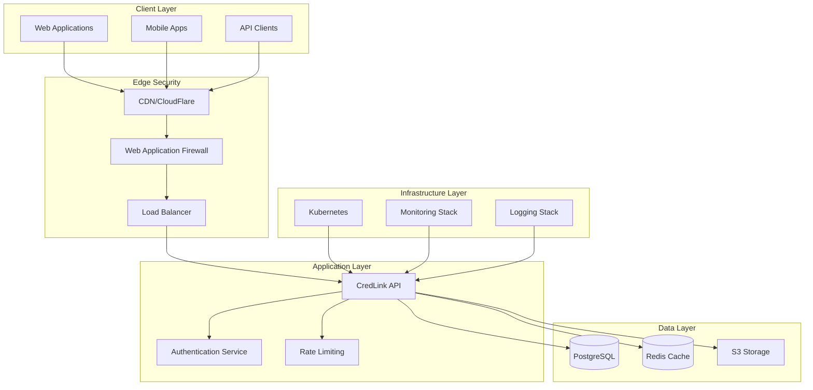
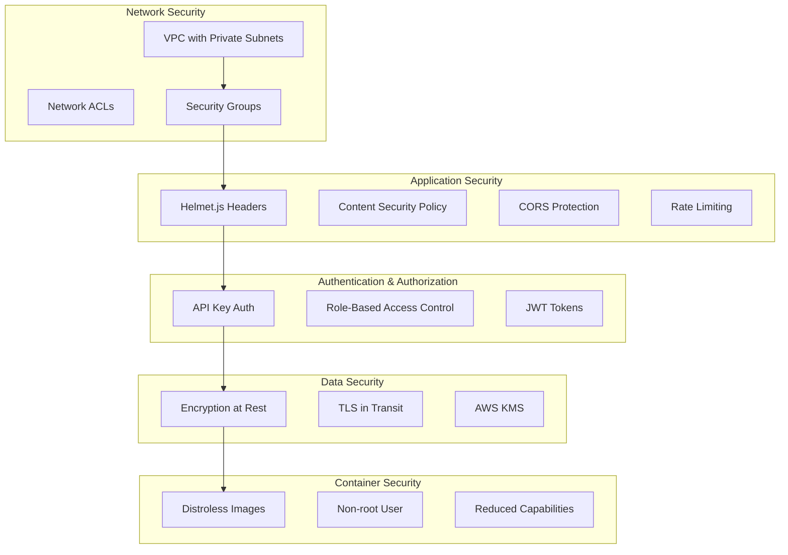
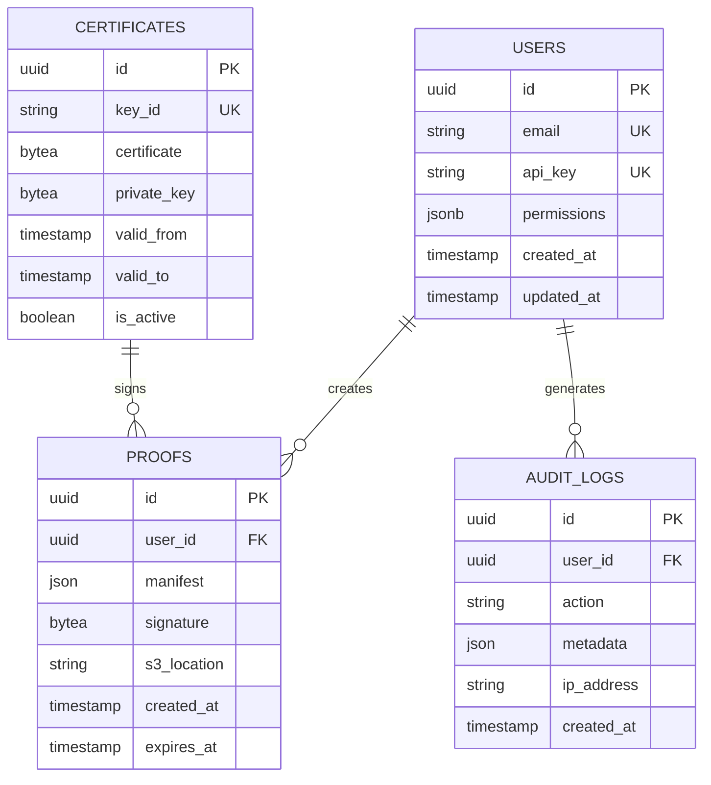
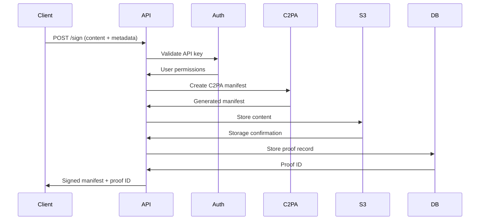
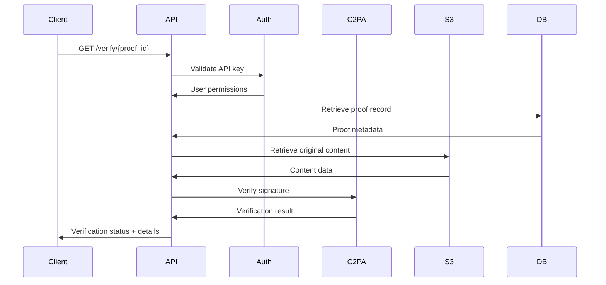
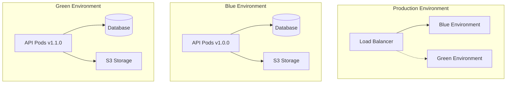
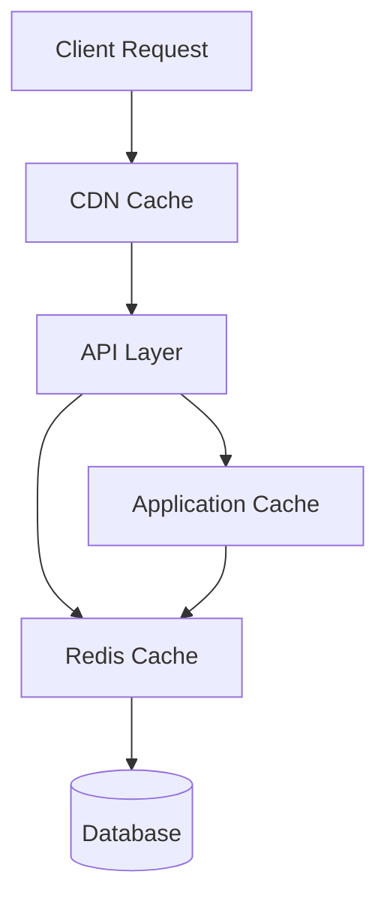
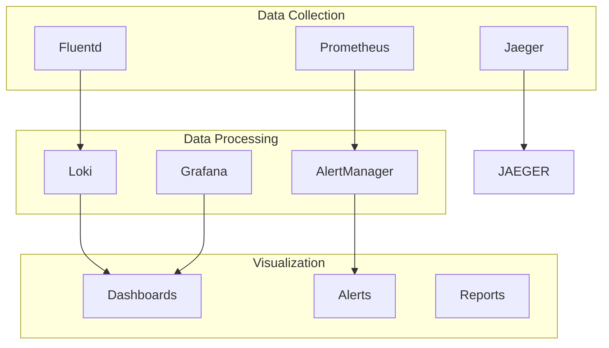
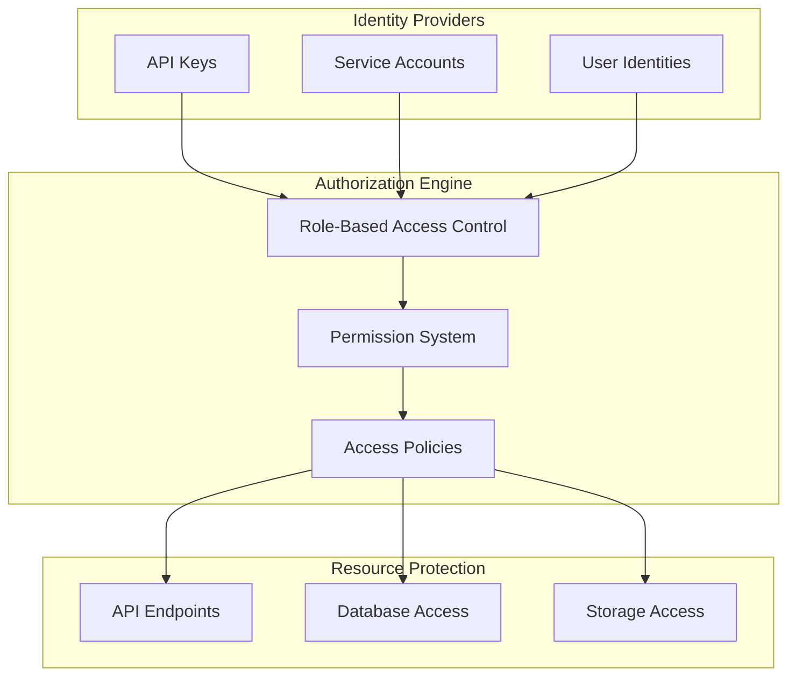
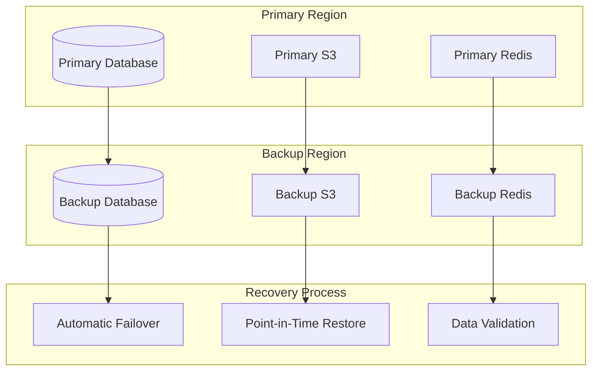

# CredLink System Architecture

## 📋 Overview

CredLink is a hardened, production-ready API for C2PA (Coalition for Content Provenance and Authenticity) digital content signing and verification. This document describes the system architecture, security model, and design principles that ensure enterprise-grade reliability, scalability, and security.

**Architecture Type:** Microservices API with PostgreSQL backend  
**Security Model:** Zero-trust with defense-in-depth  
**Deployment Pattern:** Blue-green with container orchestration  

---

## 🏗️ System Architecture

### High-Level Architecture



### Component Architecture

#### 1. API Gateway Layer
- **Load Balancer**: AWS ALB with SSL termination
- **Web Application Firewall**: CloudFlare WAF rules
- **Rate Limiting**: Per-endpoint rate limiting with Redis backend
- **Authentication**: API key-based authentication with RBAC

#### 2. Application Layer
- **CredLink API**: Node.js/Express application
- **C2PA Service**: Content signing and verification
- **Certificate Manager**: Atomic certificate rotation
- **Proof Storage**: S3-backed proof storage with encryption

#### 3. Data Layer
- **PostgreSQL**: Primary database with connection pooling
- **Redis**: Caching and session storage
- **S3**: Object storage for proofs and certificates

#### 4. Infrastructure Layer
- **Kubernetes**: Container orchestration and scaling
- **Monitoring**: Prometheus, Grafana, AlertManager
- **Logging**: Structured logging with ELK stack

---

## 🔐 Security Architecture

### Defense-in-Depth Model



### Security Controls

#### 1. Network Security
- **VPC Isolation**: Private subnets for application and database tiers
- **Network ACLs**: Restrictive network access controls
- **Security Groups**: Least-privilege firewall rules
- **Bastion Hosts**: Secure administrative access

#### 2. Application Security
- **Security Headers**: Comprehensive helmet.js configuration
- **Content Security Policy**: XSS prevention with strict CSP
- **CORS Protection**: Origin validation and whitelist
- **Rate Limiting**: DoS protection with per-endpoint limits

#### 3. Authentication & Authorization
- **API Key Authentication**: Secure key-based authentication
- **Role-Based Access Control**: Granular permission system
- **Database RBAC**: PostgreSQL role-based security
- **Session Management**: Secure session handling

#### 4. Data Security
- **Encryption at Rest**: AES-256 encryption for all data
- **TLS in Transit**: Mutual TLS for all communications
- **Key Management**: AWS KMS for cryptographic keys
- **Data Masking**: Sensitive data protection in logs

#### 5. Container Security
- **Distroless Images**: Minimal attack surface
- **Non-root Execution**: UID 1001, no shell access
- **Reduced Capabilities**: All capabilities dropped
- **Read-only Filesystem**: Immutable runtime environment

---

## 📊 Data Architecture

### Database Schema



### Data Flow Architecture

#### 1. Content Signing Flow


#### 2. Content Verification Flow


---

## 🚀 Deployment Architecture

### Blue-Green Deployment Strategy



### Kubernetes Architecture

#### Namespace Structure
```yaml
# Production Namespaces
credlink-production:     # Active production traffic
credlink-staging:        # Staging environment
credlink-green:          # New version deployment
credlink-blue:           # Current version deployment
monitoring:              # Observability stack
logging:                 # Centralized logging
```

#### Resource Management
- **Pod Autoscaling**: Horizontal pod autoscaler (2-10 replicas)
- **Resource Limits**: Memory 1Gi, CPU 500m per pod
- **Node Affinity**: Spread across multiple availability zones
- **Pod Disruption Budget**: Minimum 2 pods always available

---

## 📈 Scalability Architecture

### Horizontal Scaling

#### 1. Application Layer Scaling
- **Stateless Design**: All application components are stateless
- **Load Balancing**: Round-robin with health checks
- **Auto-scaling**: CPU and memory-based scaling
- **Connection Pooling**: Database connection pooling

#### 2. Database Layer Scaling
- **Read Replicas**: Read scaling with PostgreSQL replicas
- **Connection Pooling**: PgBouncer for connection management
- **Sharding Ready**: Architecture supports horizontal sharding
- **Caching Layer**: Redis for read-heavy operations

#### 3. Storage Layer Scaling
- **S3 Scaling**: Unlimited object storage capacity
- **CDN Integration**: Global content delivery
- **Lifecycle Policies**: Automated data archival
- **Cross-region Replication**: Disaster recovery

### Performance Optimization

#### 1. Caching Strategy


#### 2. Database Optimization
- **Index Strategy**: Optimized indexes for query patterns
- **Query Optimization**: Efficient SQL with proper joins
- **Connection Management**: Pool sizing and timeout configuration
- **Monitoring**: Query performance tracking

---

## 🔍 Monitoring Architecture

### Observability Stack



### Key Metrics

#### 1. Application Metrics
- **Request Rate**: RPS per endpoint
- **Error Rate**: 4xx/5xx error percentages
- **Response Time**: 95th percentile latency
- **Memory Usage**: Heap and RSS memory
- **CPU Usage**: Process and container CPU

#### 2. Business Metrics
- **Signing Operations**: C2PA signatures created
- **Verification Requests**: Content verifications
- **User Activity**: Active API keys and requests
- **Storage Usage**: S3 storage consumption
- **API Key Usage**: Per-key request patterns

#### 3. Infrastructure Metrics
- **Pod Health**: Restart counts and readiness
- **Node Resources**: CPU, memory, disk usage
- **Network Traffic**: Ingress/egress bandwidth
- **Database Performance**: Connection pool, query times
- **Storage Performance**: S3 request latency

---

## 🛡️ Security Model Deep Dive

### Zero Trust Architecture

#### 1. Identity and Access Management


#### 2. Data Protection Model
- **Encryption in Transit**: TLS 1.3 with perfect forward secrecy
- **Encryption at Rest**: AES-256 with envelope encryption
- **Key Management**: AWS KMS with automatic rotation
- **Data Classification**: Sensitivity labeling and handling

#### 3. Threat Prevention
- **Input Validation**: Comprehensive input sanitization
- **Output Encoding**: XSS prevention with encoding
- **SQL Injection Prevention**: Parameterized queries
- **CSRF Protection**: Anti-CSRF tokens

---

## 🔄 Disaster Recovery Architecture

### Backup and Recovery Strategy

#### 1. Data Backup


#### 2. High Availability Design
- **Multi-AZ Deployment**: Spread across availability zones
- **Active-Passive Setup**: Hot standby in backup region
- **Health Monitoring**: Comprehensive health checks
- **Automatic Failover**: DNS-based traffic routing

#### 3. Recovery Procedures
- **RTO**: 15 minutes (Recovery Time Objective)
- **RPO**: 5 minutes (Recovery Point Objective)
- **Testing**: Monthly disaster recovery drills
- **Documentation**: Detailed runbooks and procedures

---

## 🚀 Future Architecture Considerations

### Scalability Enhancements

#### 1. Microservices Evolution
- **Service Decomposition**: Split into specialized services
- **API Gateway**: Centralized routing and management
- **Service Mesh**: Istio for service communication
- **Event Streaming**: Kafka for asynchronous processing

#### 2. Performance Optimizations
- **Edge Computing**: CloudFlare Workers for edge processing
- **Database Sharding**: Horizontal database scaling
- **Caching Layers**: Multi-level caching strategy
- **CDN Integration**: Global content delivery

#### 3. Security Enhancements
- **Zero Trust Networking**: Service-to-service mTLS
- **Advanced Threat Detection**: ML-based anomaly detection
- **Compliance Automation**: Automated compliance checking
- **Privacy Engineering**: Advanced privacy controls

### Technology Roadmap

#### Short-term (3-6 months)
- Enhanced monitoring and alerting
- Performance optimization
- Security hardening improvements
- Documentation expansion

#### Medium-term (6-12 months)
- Microservices architecture transition
- Advanced caching implementation
- Machine learning integration
- Global deployment expansion

#### Long-term (12+ months)
- Edge computing capabilities
- Advanced threat detection
- Blockchain integration
- Quantum-resistant cryptography

---

## 📚 Architecture Decisions

### Key Design Decisions

#### 1. Technology Choices
- **Node.js**: Rapid development and ecosystem
- **PostgreSQL**: ACID compliance and reliability
- **Kubernetes**: Container orchestration and scaling
- **AWS**: Enterprise-grade cloud services

#### 2. Security Decisions
- **API Key Authentication**: Simple and effective for API access
- **Role-Based Access Control**: Granular permission management
- **Distroless Containers**: Minimal attack surface
- **Defense-in-Depth**: Multiple security layers

#### 3. Operational Decisions
- **Blue-Green Deployment**: Zero-downtime deployments
- **Infrastructure as Code**: Reproducible environments
- **Observability First**: Comprehensive monitoring
- **Automation Priority**: Reduced manual operations

### Trade-offs and Considerations

#### 1. Performance vs. Security
- **Decision**: Prioritize security with minimal performance impact
- **Implementation**: Efficient security controls and caching
- **Monitoring**: Performance metrics with security validation

#### 2. Complexity vs. Maintainability
- **Decision**: Balance feature richness with maintainability
- **Implementation**: Modular design with clear interfaces
- **Documentation**: Comprehensive architecture documentation

#### 3. Cost vs. Reliability
- **Decision**: Invest in reliability for critical services
- **Implementation**: Cost-effective high availability design
- **Optimization**: Continuous cost and performance optimization

---

## 📞 Architecture Governance

### Design Principles

1. **Security First**: Every design decision considers security implications
2. **Scalability by Design**: Architecture supports growth from day one
3. **Observability Built-in**: Monitoring and logging are core requirements
4. **Automation Priority**: Manual processes are eliminated where possible
5. **Compliance by Default**: Regulatory requirements are built into the design

### Review Process

#### Architecture Review Board
- **Composition**: Senior engineers, security experts, operations leads
- **Frequency**: Monthly reviews and ad-hoc for major changes
- **Scope**: All architectural changes and significant technical decisions
- **Documentation**: All decisions recorded and justified

#### Change Management
- **Proposal**: Detailed technical design with rationale
- **Review**: Security, performance, and operational impact assessment
- **Approval**: Board consensus with documented approval
- **Implementation**: Controlled rollout with monitoring

---

*Last Updated: November 2025*  
*Version: 1.0.0*  
*Maintained by: Architecture Team*  
*Review Cycle: Quarterly*
